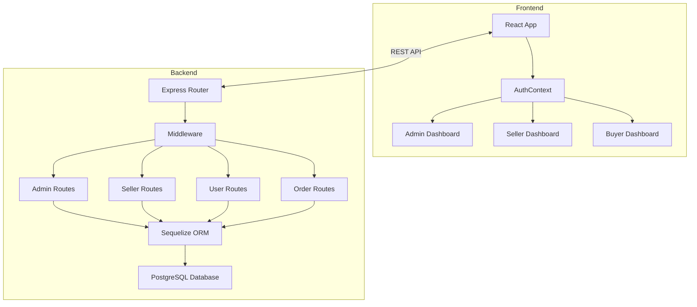
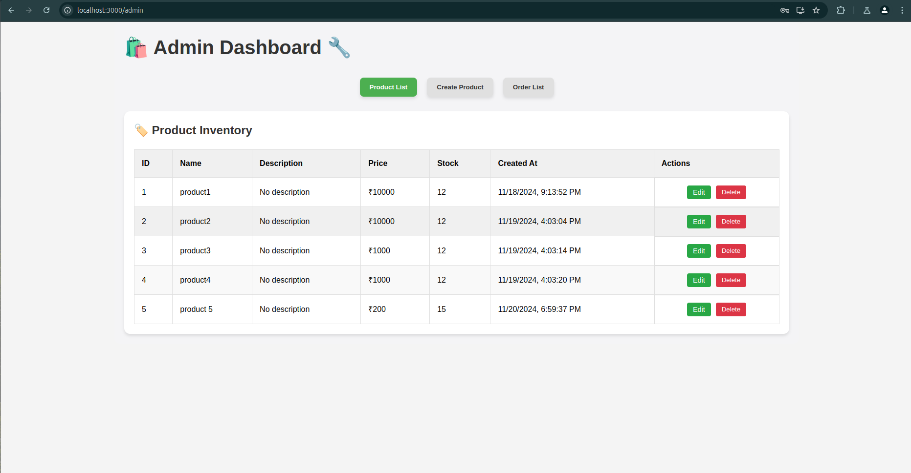
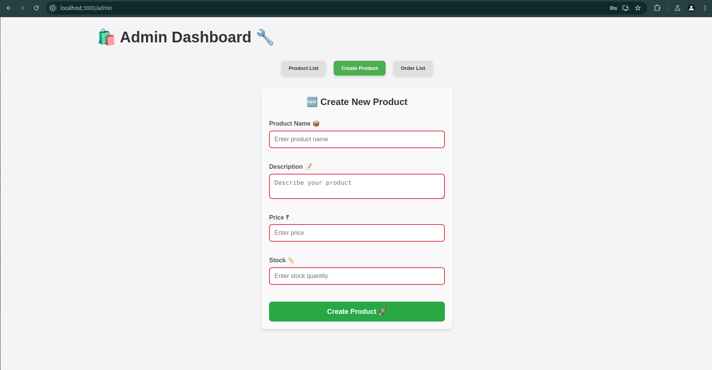
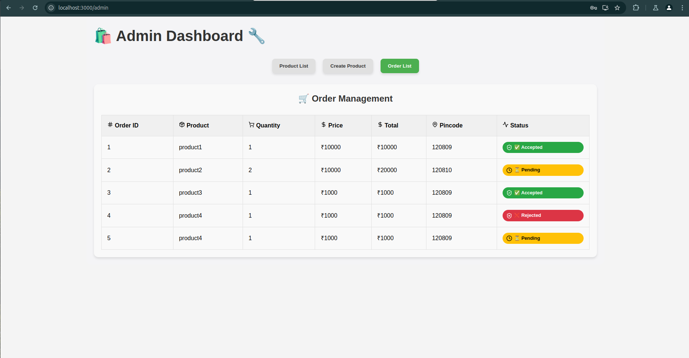
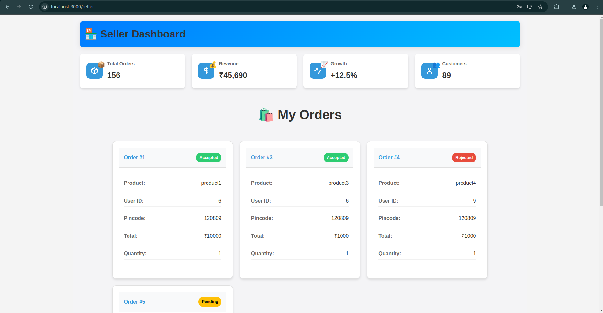
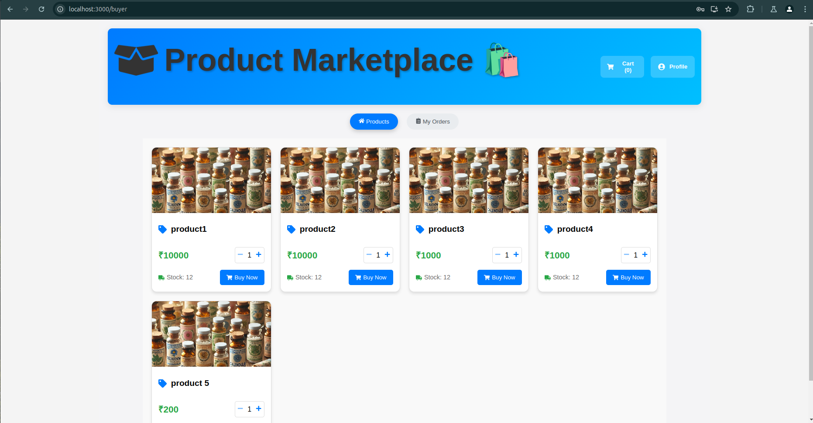
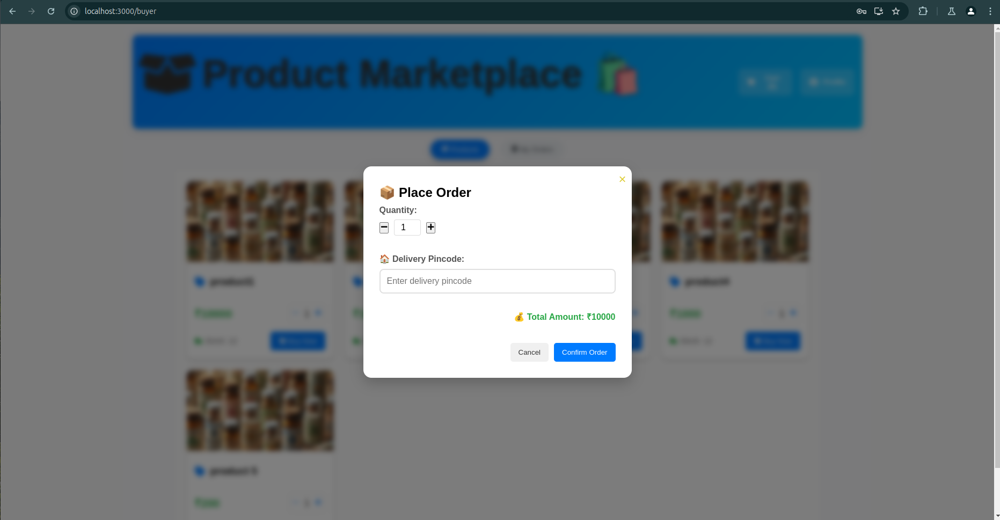
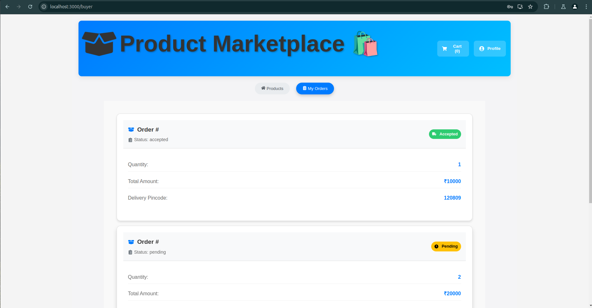

## 🔐 RBAC Assignment Details

### Assignment Overview: Role-Based Access Control (RBAC)

#### Objective

The goal of this assignment is to assess understanding and implementation skills regarding:

- Authentication
- Authorization
- Role-Based Access Control (RBAC)

#### Project Implementation

Our Medicine E-commerce Platform demonstrates RBAC through:

##### Authentication Mechanisms

- Secure user registration and login
- JWT-based token authentication
- Role-specific access tokens

##### Role-Based Permissions

### 👥 User Roles

- **Admin** 🔑
  - Manage products
  - Create sellers
  - View all orders
  - Monitor platform activity
- **Seller** 💼
  - View assigned orders
  - Accept/Reject orders
  - Track sales and revenue
- **Buyer** 🛒
  - Browse products
  - Place orders
  - Track order status
  - Manage shopping cart

##### Security Implementation

- Middleware-based route protection
- Token validation for each request
- Role-specific route access
- Secure password hashing
- Comprehensive error handling

#### Key Security Features

- Centralized authentication system
- Granular access control
- Secure user data management
- Scalable role management

## 📋 Table of Contents

- [Features](#features)
- [Architecture](#architecture)
- [Tech Stack](#tech-stack)
- [Project Structure](#project-structure)
- [Models](#models)
- [API Endpoints](#api-endpoints)
- [Authentication & Authorization](#authentication--authorization)
- [Setup & Installation](#setup--installation)
- [Project Images](#project-images)

## ✨ Features

## 🏗 Architecture



## 🛠 Tech Stack

### Backend

- **Node.js** with **Express Framework** 🚀
- **Sequelize ORM** for database operations 📊
- **JWT** for authentication 🔐
- **PostgreSQL** database 🐘

### Frontend

- **React** for UI 📱
- **React Router** for navigation 🧭
- **Context API** for state management 🔄
- **Lucide React** for icons 🎨

## 📁 Project Structure

```
.
├── frontend/
│   ├── src/
│   │   ├── components/
│   │   │   ├── Auth/
│   │   │   ├── Dashboard/
│   │   │   └── Products/
│   │   ├── contexts/
│   │   ├── utils/
│   │   └── App.js
│   └── package.json
│
└── backend/
    ├── src/
    │   ├── config/
    │   ├── controllers/
    │   ├── middleware/
    │   ├── models/
    │   ├── routes/
    │   └── app.js
    └── package.json
```

## 📊 Models

### User Model

```javascript
const User = sequelize.define("User", {
  name: {
    type: DataTypes.STRING,
    allowNull: false,
  },
  email: {
    type: DataTypes.STRING,
    unique: true,
    allowNull: false,
  },
  password: {
    type: DataTypes.STRING,
    allowNull: false,
  },
  phone: DataTypes.STRING,
  address: DataTypes.TEXT,
  pincode: DataTypes.STRING,
  userType: {
    type: DataTypes.ENUM("admin", "seller", "buyer"),
    allowNull: false,
  },
});
```

### Order Model

```javascript
const Order = sequelize.define("Order", {
  userId: {
    type: DataTypes.INTEGER,
    allowNull: false,
  },
  sellerId: DataTypes.INTEGER,
  productId: {
    type: DataTypes.INTEGER,
    allowNull: false,
  },
  productName: DataTypes.STRING,
  quantity: {
    type: DataTypes.INTEGER,
    allowNull: false,
  },
  price: {
    type: DataTypes.DECIMAL(10, 2),
    allowNull: false,
  },
  totalAmount: {
    type: DataTypes.DECIMAL(10, 2),
    allowNull: false,
  },
  pincode: DataTypes.STRING,
  status: {
    type: DataTypes.ENUM("pending", "accepted", "rejected", "completed"),
    defaultValue: "pending",
  },
  rejectReason: DataTypes.TEXT,
});
```

### Product Model

```javascript
const Product = sequelize.define("Product", {
  name: {
    type: DataTypes.STRING,
    allowNull: false,
  },
  description: DataTypes.TEXT,
  price: {
    type: DataTypes.DECIMAL(10, 2),
    allowNull: false,
  },
  stock: {
    type: DataTypes.INTEGER,
    allowNull: false,
  },
  adminId: {
    type: DataTypes.INTEGER,
    allowNull: false,
  },
});
```

## 🔌 API Endpoints

### Public Routes

- `POST /api/v1/register` - User registration
- `POST /api/v1/login` - User authentication
- `GET /api/v1/products` - List all products

### Protected Routes

#### Admin Routes

- `POST /api/v1/admin/products` - Create product
- `PUT /api/v1/admin/products/:id` - Update product
- `DELETE /api/v1/admin/products/:id` - Delete product
- `POST /api/v1/admin/sellers` - Create seller
- `GET /api/v1/admin/getallorders` - View all orders

#### Seller Routes

- `GET /api/v1/seller/orders` - View assigned orders
- `POST /api/v1/seller/orders/:id/respond` - Respond to order

#### User Routes

- `GET /api/v1/user/profile` - Get user profile
- `PUT /api/v1/user/profile` - Update user profile
- `POST /api/v1/orders` - Create order
- `GET /api/v1/orders` - Get user orders

## 🔒 Authentication & Authorization

The application uses JWT-based authentication with role-based access control:

1. User authenticates via `/login` endpoint
2. Backend generates JWT token
3. Frontend stores token in AuthContext
4. Token is included in Authorization header for protected routes
5. Middleware validates token and user role for protected routes

## 🚀 Setup & Installation

### Backend Setup

1. Install Node.js 14 or later
2. Clone the repository
3. Set up PostgreSQL database
4. Configure environment variables
5. Run:

```bash
cd backend
npm install
npm start
```

### Frontend Setup

1. Install Node.js 14 or later
2. Navigate to frontend directory
3. Install dependencies:

```bash
cd frontend
npm install
npm start
```

## 📷 Screenshots

### Admin Dashboard







### Seller Dashboard



## Buyer Dashboard







## 🤝 Contributing

Please read CONTRIBUTING.md for details on our code of conduct and the process for submitting pull requests.

## 📄 License

This project is licensed under the MIT License - see the LICENSE.md file for details
